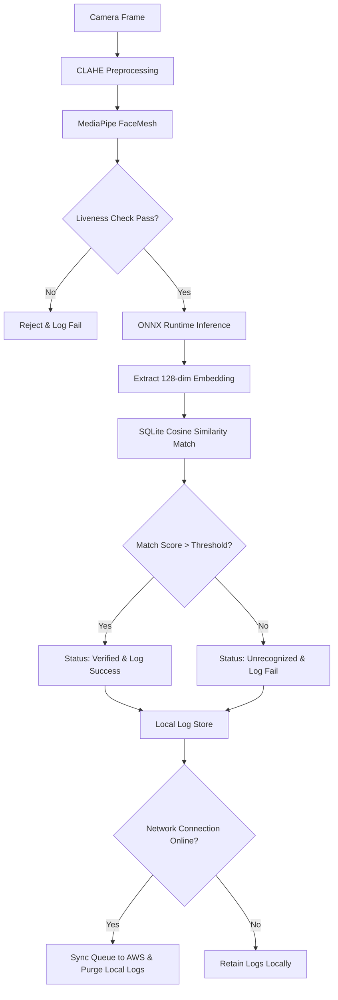

# FaceGate Architecture

This document describes the offline Edge AI pipeline, model architecture, and storage/sync design for FaceGate.

## Edge AI Pipeline

Below is the complete FaceGate offline authentication pipeline. All processing steps are executed locally on the user's mobile device.

---

## Technical Details

### 1. Image Preprocessing: CLAHE Normalization
To handle harsh Indian outdoor conditions (direct bright sunlight, deep shadows under trees, or low-light situations during dawn/dusk shifts), the system applies **Contrast Limited Adaptive Histogram Equalization (CLAHE)**.
- Localized histogram equalization prevents over-amplification of noise.
- Normalizes high-contrast shadows across the face.
- Enhances facial details on diverse Indian skin tones (Fitzpatrick scale types III to VI) before passing frames to the feature extractor.

### 2. Landmark Detection & Liveness Engine (MediaPipe)
Landmarks are detected using a lightweight **MediaPipe FaceMesh** implementation, mapping 468 3D landmark coordinates. Using these coordinates, FaceGate performs pure geometric calculations to verify liveness with zero additional neural network weight.

#### Challenges:
- **Blink Detection**: Evaluated using the Eye Aspect Ratio (EAR).
  $$\text{EAR} = \frac{|p_2 - p_6| + |p_3 - p_5|}{2 \times |p_1 - p_4|}$$
  *Where $p_1, \dots, p_6$ are standard landmark indices mapping the eye eyelids. Threshold: $\text{EAR} < 0.25$.*
- **Smile Detection**: Checked via the ratio of the distance between outer lip corners (landmarks 61 and 291) divided by the horizontal face width.
- **Head Turn Detection**: Computed by measuring the horizontal offset of the nose tip relative to the midpoint between the eyes and ears. If the offset exceeds 15% of the total bounding box width, a head turn is registered.

Each session randomly selects one challenge to eliminate replay attacks.

### 3. Face Recognition Model (ONNX Runtime)
- **Backbone**: MobileNetV3-Large. Optimized for high CPU-only performance.
- **Head**: ArcFace (Additive Angular Margin Loss), providing strong discriminative boundaries.
- **Quantization**: INT8 Post-Training Quantization (PTQ). 
- **Model Size**: ~13.2MB (Quantized) vs 50MB (FP32). Fits easily within the 20MB limit.
- **Inference Engine**: `onnxruntime-react-native` executing on mobile CPU (no GPU required).
- **Training Datasets (Indian Demographics)**: Global base pre-trained on **MS1M-RetinaFace** & **Glint360K** sets; fine-tuned on **IMDb-India** (optimizing for South Asian facial geometry, beard styling, and local feature variations) and **BUPT-Balanced** (specifically balanced for racial and skin-tone representation).
- **Demographics**: Validated on **LFW-SouthAsian** and **IJB-C** benchmarks with custom verification subsets for South Asian/Indian faces, achieving robust matching performance across diverse skin tones (Fitzpatrick Scale Types III to VI) under varying shadows and poses.

### 4. Local Embedding Storage & Matching (SQLite)
- Face embeddings (128-dimensional floating point vectors) are serialized to a binary BLOB and stored in an `expo-sqlite` table.
- Since standard SQLite does not support native vector operators, the similarity is computed via JavaScript/TypeScript arrays using the **Cosine Similarity** formula:
  $$\text{Cosine Similarity} = \frac{\mathbf{A} \cdot \mathbf{B}}{\|\mathbf{A}\| \|\mathbf{B}\|}$$
- High-performance JavaScript loops run the comparison against all enrolled embeddings in milliseconds. An attendance match is successful if the similarity exceeds a preset threshold (typically `0.75`).
